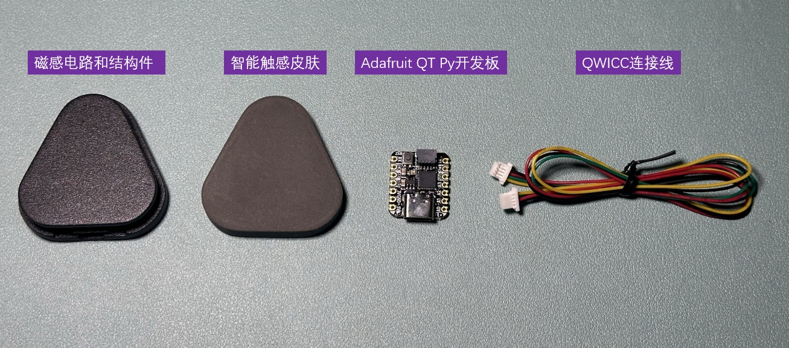
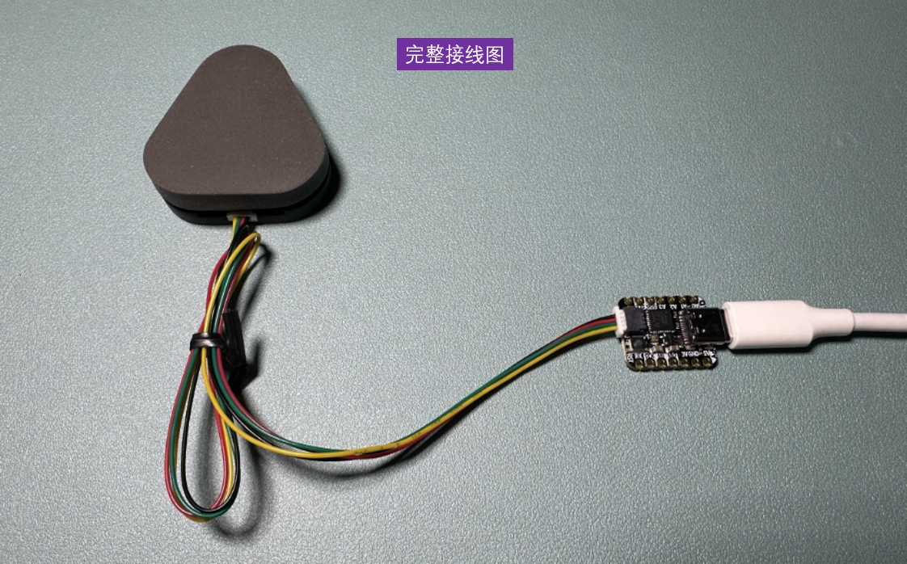
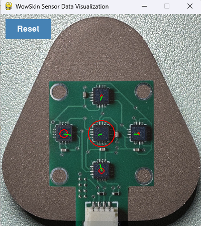

# WowSkin

WowSkin 是一款针对智能触觉皮肤设计的开源解决方案。本项目基于 [AnySkin](https://any-skin.github.io/) 和 [ReSkin](https://reskin.dev/) 的开源基础，加入了针对特定应用场景的改进和新功能。

## 功能特点

- **增强的磁传感器驱动**：提升了与 MLX90393 等传感器的兼容性和性能。
- **实时可视化**：通过自定义可视化工具，轻松查看磁场数据。
- **改进的算法**：提供更精确的 XYZ 磁场分析，并降低噪声。
- **灵活的架构**：模块化代码结构，便于定制和扩展。

---

## 硬件

WowSkin 的硬件设计为 **专有**，未包含在此开源仓库中。如果您对 WowSkin 硬件感兴趣，请联系我们或访问我们的 [官方商店](https://item.taobao.com/item.htm?ft=t&id=863972140022)。

### 支持的硬件

WowSkin 旨在与我们专有的硬件无缝配合使用，包括：

- 预校准的磁传感器阵列。
- 高性能数据采集模块。
- 即插即用的兼容连接器。

如果您选择使用其他硬件，可能需要对代码进行一些修改。

### 软件与硬件的开源声明

本项目的 **软件代码** 完全开源，遵循 [MIT License](LICENSE) 许可协议，您可以自由使用、修改和分发。

硬件部分的 **开发板固件代码** 会在购买 WowSkin 硬件后免费赠送。这种方式确保用户可以根据自己的需求对硬件进行进一步开发，同时保护我们在硬件设计和制造上的投入。

---

## 环境要求

- Python 3.8 或更高版本

---

## **安装方法**

1. **克隆此仓库**  
   在终端中运行以下命令克隆项目：
   ```bash
   git clone https://github.com/WowRobo-Robotics/WowSkin.git
   ```

2. **进入项目目录**  
   在克隆完成后，进入项目目录：
   ```bash
   cd WowSkin
   ```

3. **安装依赖**  
   使用 `pip` 安装项目依赖：
   ```bash
   pip install -e .
   ```

---

## **快速使用指南**

1. **硬件连接**  
 
   

2. **检测 COM 端口**  
   - 确认您的微控制器连接到的设备路径（`<port>`），具体步骤如下：
     - **Linux**: `ls /dev/ | grep -e ACM -e USB`（一般为 `/dev/ttyACM0` 或 `/dev/ttyUSB0`）。
     - **MacOS**: `ls /dev/ | grep cu.usb`（一般为 `cu.usbmodem*`）。
     - **Windows**: 打开设备管理器并查看 "端口(COM & LPT)"，如 `COM3`。

3. **运行可视化工具**  
   使用以下命令运行可视化工具：
   ```bash
   python wowskin_viz.py -p <port>
   ```
   替换 `<port>` 为您在上一步找到的实际端口号。

   ### 实际命令示例
   假设您在 Windows 系统上，设备连接到 `COM3`，您可以运行以下命令：
   ```bash
   python wowskin_viz.py -p COM3
   ```

   或者在 Linux 系统上，设备连接到 `/dev/ttyACM0`，您可以运行以下命令：
   ```bash
   python wowskin_viz.py -p /dev/ttyACM0
   ```

4. **重新校准零点**  
   在可视化窗口中点击 **RESET** 按钮以重新校准零点。这种方式更直观，不受窗口激活状态限制。

   


---

## **功能亮点**

- **实时磁场感知**：高精度采集 XYZ 方向的磁场变化。
- **模块化设计**：支持多种使用场景的扩展和定制。
- **跨平台支持**：兼容 Windows、Linux 和 MacOS 操作系统。
- **可视化工具**：内置实时可视化功能，便于快速调试和演示。

---

## **联系我们**

如果您有任何问题或需要帮助，可以通过以下方式联系我们：

- **QQ群**：517472861
- **微信号**：xiaonian52,添加时请注明“咨询WowSkin”

欢迎加入我们的社区，与更多开发者交流！


---

## **许可证**

WowSkin 使用 [MIT License](LICENSE) 许可证开源软件部分。  
硬件设计为专有内容，未包含在开源范围内。如需了解更多或购买硬件，请访问我们的 [官方商店](https://yourstore.com)。

