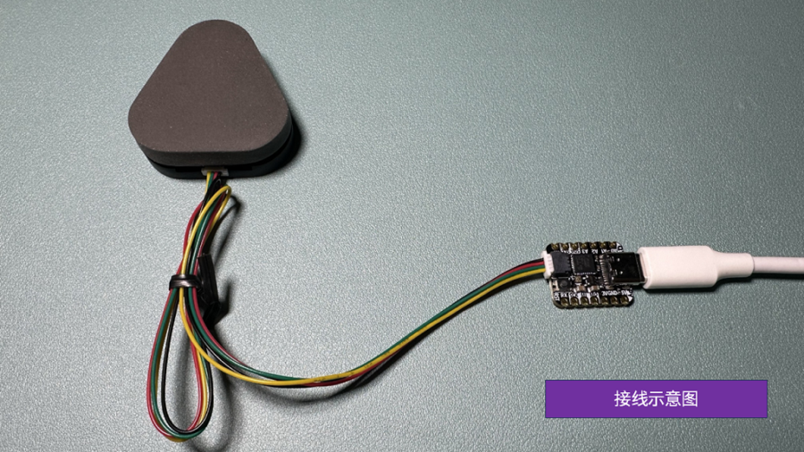
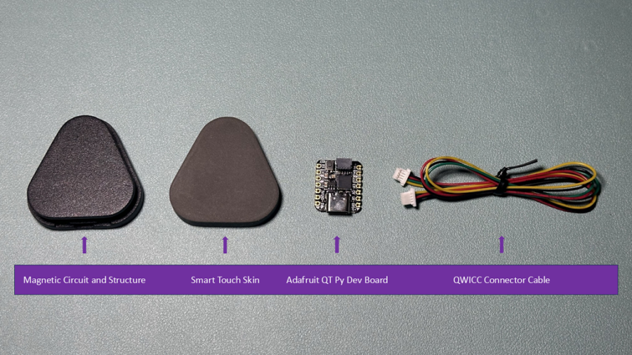
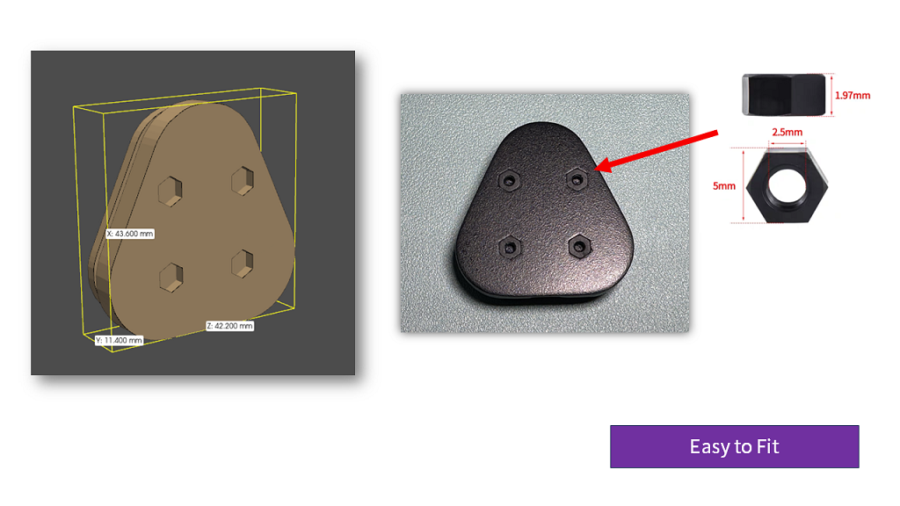

# WowSkin

[中文](#中文版) | [English](#english-version)

---

## 中文版

> ⚠️ 本项目基于 [AnySkin](https://github.com/raunaqbhirangi/anyskin) 项目，仅增加了一个图形化 Reset 按钮。核心算法全部来自原始 AnySkin 项目，推荐用户根据实际需求优先选择使用官方版本。


## 硬件

WowSkin 硬件基于 [AnySkin](https://github.com/raunaqbhirangi/anyskin) 项目的磁性感知方案，进行了批量化生产，适用于教学演示与研究场景。

> 如果您希望了解此类磁性感知硬件的设计原理与背景，请参考原作者发布的 [AnySkin 项目主页](https://any-skin.github.io/)。

如果您对 WowSkin 硬件感兴趣，请联系我们或访问我们的官方商店。

📍 [淘宝官方店铺（中文版）](https://item.taobao.com/item.htm?ft=t&id=863972140022)  
📍 [官方商店（海外版）](https://shop.wowrobo.com/products/enhanced-anyskin-premium-crafted-editionwowskin)

## 环境要求

- Python 3.8 或更高版本

---

## **安装方法**

1. **克隆此仓库**  
   在终端中运行以下命令克隆项目：
   ```bash
   git clone https://github.com/WowRobo-Robotics/WowSkin.git
   ```

2. **进入项目目录**  
   在克隆完成后，进入项目目录：
   ```bash
   cd WowSkin
   ```

3. **创建并启用虚拟环境 (推荐)**

   * **Windows**:

     ```bash
     python -m venv .venv
     .venv\Scripts\activate
     ```
   * **macOS / Linux**:

     ```bash
     python3 -m venv .venv
     source .venv/bin/activate
     ```

4. **安装依赖**

   ```bash
   pip install -r requirements.txt
   ```


---

## **快速使用指南**

1. **硬件连接**  
   
   


2. **检测 COM 端口**  
   - 确认您的微控制器连接到的设备路径（`<port>`），具体步骤如下：
     - **Linux**: `ls /dev/ | grep -e ACM -e USB`（一般为 `/dev/ttyACM0` 或 `/dev/ttyUSB0`）。
     - **MacOS**: `ls /dev/ | grep cu.usb`（一般为 `cu.usbmodem*`）。
     - **Windows**: 打开设备管理器并查看 "端口(COM & LPT)"，如 `COM3`。

3. **运行可视化工具**  
   使用以下命令运行可视化工具：
   ```bash
   python wowskin_viz.py -p <port>
   ```
   替换 `<port>` 为您在上一步找到的实际端口号。

   #### 示例：
   - **Windows 示例**：如果您的设备连接到 `COM3`，运行以下命令：
     ```bash
     python wowskin_viz.py -p COM3
     ```

   - **Linux 示例**：如果设备路径为 `/dev/ttyACM0`，运行以下命令：
     ```bash
     python wowskin_viz.py -p /dev/ttyACM0
     ```

4. **重新校准零点**  
   在可视化窗口中点击 **Reset** 按钮以重新校准零点。这种方式更直观，不受窗口激活状态限制。

   

---


## **联系我们**

如果您有任何问题或需要帮助，可以通过以下方式联系我们：

- **微信号**：xiaonian52，添加时请注明“咨询WowSkin”

欢迎加入我们的社区，与更多开发者交流！

---

## **许可证**

WowSkin 使用 [MIT License](LICENSE) 许可证开源软件部分。  
硬件设计为专有内容，未包含在开源范围内。如需了解更多或购买硬件，请访问我们的 [官方商店](https://item.taobao.com/item.htm?ft=t&id=863972140022)。


---


## English Version

WowSkin is an open-source solution designed for intelligent tactile skins. Based on [AnySkin](https://any-skin.github.io/) and [ReSkin](https://reskin.dev/), it includes targeted improvements and new features for specific application scenarios.

## Features

- **Enhanced Magnetic Sensor Driver**: Improved compatibility and performance with sensors.
- **Real-Time Visualization**: Easily visualize magnetic field data using customized visualization tools.
- **Improved Algorithms**: More accurate XYZ magnetic field analysis with reduced noise.
- **Flexible Architecture**: Modular code structure for easy customization and extension.

---

## Hardware

The hardware design of WowSkin is **proprietary** and is not included in this open-source repository. If you are interested in WowSkin hardware, please contact us or visit our [official store](https://shop.wowrobo.com/products/enhanced-anyskin-premium-crafted-editionwowskin).

### Supported Hardware

WowSkin is designed to work seamlessly with our proprietary hardware, including:

- Pre-calibrated magnetic sensor arrays.
- High-performance data acquisition modules.
- Plug-and-play compatible connectors.

If you choose to use other hardware, you may need to modify the code accordingly.

### Open-Source Software and Hardware Declaration

The **software code** of this project is fully open-source and follows the [MIT License](LICENSE), allowing free use, modification, and distribution.

The **firmware code** for the development board will be provided free of charge upon purchasing WowSkin hardware. This ensures that users can further develop the hardware according to their needs while protecting our investment in hardware design and manufacturing.

---

## Requirements

- Python 3.8 or higher

---

## **Installation**

1. **Clone the repository**  
   Run the following command in the terminal to clone the project:
   ```bash
   git clone https://github.com/WowRobo-Robotics/WowSkin.git
   ```

2. **Enter the project directory**  
   After cloning, navigate into the project directory:
   ```bash
   cd WowSkin
   ```

3. **Install dependencies**  
   Use `pip` to install the project dependencies:
   ```bash
   pip install -e .
   ```

---

## **Quick Start Guide**

1. **Hardware Connection**  
   
   

2. **Check COM Port**  
   - Confirm the device path (`<port>`) of your microcontroller:
     - **Linux**: `ls /dev/ | grep -e ACM -e USB` (usually `/dev/ttyACM0` or `/dev/ttyUSB0`).
     - **MacOS**: `ls /dev/ | grep cu.usb` (usually `cu.usbmodem*`).
     - **Windows**: Open Device Manager and check "Ports (COM & LPT)", e.g., `COM3`.

3. **Run the Visualization Tool**  
   Use the following command to run the visualization tool:
   ```bash
   python wowskin_viz.py -p <port>
   ```
   Replace `<port>` with the actual port number from the previous step.

   #### Examples:
   - **Windows Example**: If your device is connected to `COM3`, run the following command:
     ```bash
     python wowskin_viz.py -p COM3
     ```

   - **Linux Example**: If the device path is `/dev/ttyACM0`, run the following command:
     ```bash
     python wowskin_viz.py -p /dev/ttyACM0
     ```

4. **Recalibrate Zero Point**  
   Click the **Reset** button in the visualization window to recalibrate the zero point. This method is more intuitive and not restricted by window focus.

   

---

## **Highlights**

- **Real-Time Magnetic Field Sensing**: High-precision XYZ magnetic field data collection.
- **Modular Design**: Supports extension and customization for various use cases.
- **Cross-Platform Support**: Compatible with Windows, Linux, and MacOS.
- **Visualization Tool**: Built-in real-time visualization for quick debugging and demonstrations.
   
---

## **Contact Us**

If you have any questions or need assistance, please contact us via:

- **Email**: leo.xiao@wowrobo.com
- **WeChat**: xiaonian52 (please mention "WowSkin Inquiry" when adding)

Join our community and connect with other developers!

---

## **License**

WowSkin is released under the [MIT License](LICENSE) for the open-source software portion.  
The hardware design is proprietary and not included in the open-source scope. For more information or to purchase hardware, please visit our [official store](https://shop.wowrobo.com/products/enhanced-anyskin-premium-crafted-editionwowskin).
